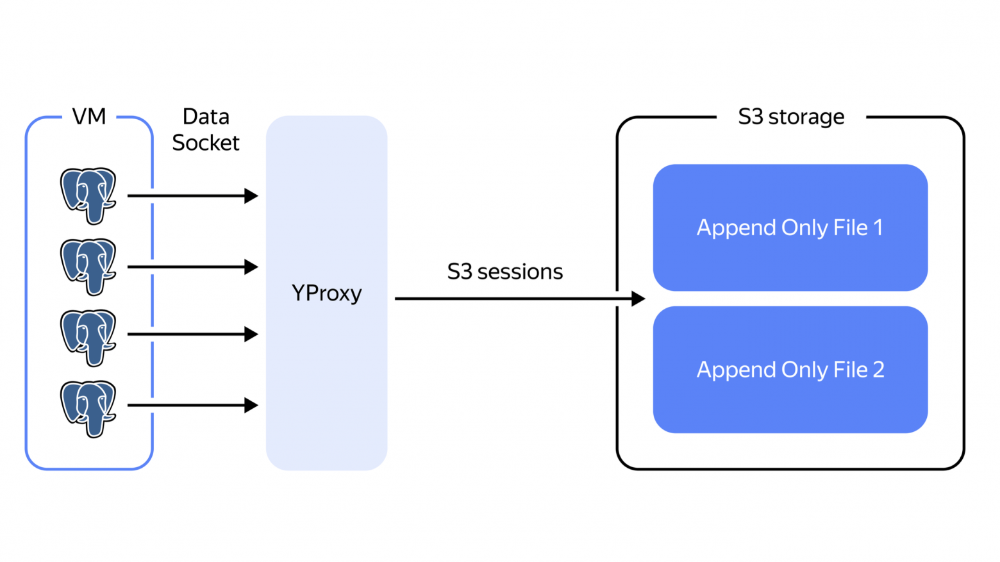
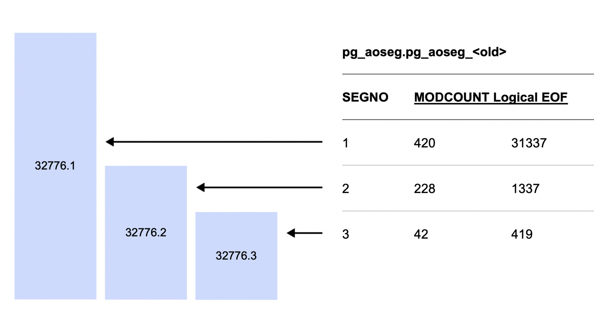
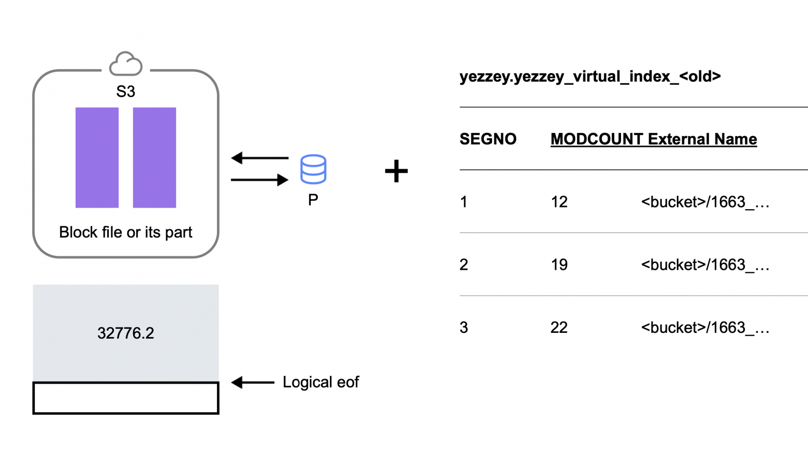

# Yezzey

Yezzey is a Apache Cloudberry/Greenplum6 extension, which makes AO/AOCO data be offloaded to S3.

```
      /------\                   Cloud (external storage) e.g. S3
     |\______/|                /-------\
     |  GP    |               (         )
     | segment|     ----->     \vvvvvvv/
     |\______/|
     |        |
     |        |
      \______/
```


## General description

Our solution is architecturally similar to [Snowflake](https://www.snowflake.com/wp-content/uploads/2019/06/Snowflake_SIGMOD.pdf)+[AnyBlob](https://vldb.org/pvldb/vol16/p2769-durner.pdf).

What are our extension doing is:
- expand the smgr interface and added the ability to work with Object Storage S3;
- create yezzey extension's objects to manage uploading/downloading from Object Storage;
- create a special YProxy service to proxy requests from Apache Cloudberry/Greenplum6 to S3 storage.

The result was called yezzey. The idea is to be able to offload data to S3 without a significant degradation of query performance and changes to the user interface.

## Interfaces

Yezzey currently only works with Append Only (AO/AOCO) Greenplum tables. The simple example:

```
postgres=# create table test(i int, j int, k int, kk int) with(appendonly=true, orientation=column) DISTRIBUTED RANDOMLY;
CREATE TABLE
postgres=# insert into test select * from generate_series(1, 100) a join generate_series(1, 100) b on true join generate_series(1, 100) c on true join generate_series(1, 100) d on true;
INSERT 0 100000000
postgres=# select count(1) from public.test;
   count
-----------
 100000000

Time: 5762.468 ms
```

### Upload data to S3

Data is uploaded to S3 by calling the `yezzey_define_offload_policy(reloid OID, remove_locally BOOLEAN)` method from the yezzey extension:

```
postgres=# select yezzey_define_offload_policy('public', 'test');
NOTICE:  yezzey: relation virtual size calculated: 0  (seg0 slice1 10.129.0.12:6000 pid=706966)
NOTICE:  yezzey: relation virtual size calculated: 0  (seg1 slice1 10.129.0.30:6000 pid=707950)
INFO:  yezzey: relation segment reached external storage (blkno=1), up to logical eof 200242112  (seg0 slice1 10.129.0.12:6000 pid=706966)
INFO:  yezzey: relation segment reached external storage (blkno=1), up to logical eof 200295736  (seg1 slice1 10.129.0.30:6000 pid=707950)
NOTICE:  yezzey: relation virtual size calculated: 0  (seg1 slice1 10.129.0.30:6000 pid=707950)
NOTICE:  yezzey: relation virtual size calculated: 0  (seg0 slice1 10.129.0.12:6000 pid=706966)
INFO:  yezzey: relation segment reached external storage (blkno=129), up to logical eof 200295736  (seg1 slice1 10.129.0.30:6000 pid=707950)
NOTICE:  yezzey: relation virtual size calculated: 0  (seg1 slice1 10.129.0.30:6000 pid=707950)
INFO:  yezzey: relation segment reached external storage (blkno=129), up to logical eof 200242112  (seg0 slice1 10.129.0.12:6000 pid=706966)
NOTICE:  yezzey: relation virtual size calculated: 0  (seg0 slice1 10.129.0.12:6000 pid=706966)
INFO:  yezzey: relation segment reached external storage (blkno=257), up to logical eof 200295736  (seg1 slice1 10.129.0.30:6000 pid=707950)
NOTICE:  yezzey: relation virtual size calculated: 0  (seg1 slice1 10.129.0.30:6000 pid=707950)
INFO:  yezzey: relation segment reached external storage (blkno=257), up to logical eof 200242112  (seg0 slice1 10.129.0.12:6000 pid=706966)
NOTICE:  yezzey: relation virtual size calculated: 0  (seg0 slice1 10.129.0.12:6000 pid=706966)
INFO:  yezzey: relation segment reached external storage (blkno=385), up to logical eof 200295736  (seg1 slice1 10.129.0.30:6000 pid=707950)
INFO:  yezzey: relation segment reached external storage (blkno=385), up to logical eof 200242112  (seg0 slice1 10.129.0.12:6000 pid=706966)
 yezzey_define_offload_policy
------------------------------

(1 row)

Time: 63464.499 ms

postgres=# select count(1) from public.test;
   count
-----------
 100000000
(1 row)

Time: 6331.992 ms

postgres=# select offload_reloid, segindex, segfileindex, external_storage_filepath, external_bytes from yezzey_relation_describe_external_storage_structure('test');
 offload_reloid | segindex | segfileindex |                                                   external_storage_filepath                                                    | external_bytes
----------------+----------+--------------+--------------------------------------------------------------------------------------------------------------------------------+----------------
          32176 |        1 |            0 | wal-e/6/segments_005/seg1/basebackups_005/yezzey/1663_12813_81b5e60c711c42d92d6115c2140f6be4_27082_1__DY_1_xlog_279307134824   | 200296702
          32176 |        1 |            0 | wal-e/6/segments_005/seg1/basebackups_005/yezzey/1663_12813_81b5e60c711c42d92d6115c2140f6be4_27082_129__DY_1_xlog_279307157504 | 200296702
          32176 |        1 |            0 | wal-e/6/segments_005/seg1/basebackups_005/yezzey/1663_12813_81b5e60c711c42d92d6115c2140f6be4_27082_257__DY_1_xlog_279307179720 | 200296702
          32176 |        1 |            0 | wal-e/6/segments_005/seg1/basebackups_005/yezzey/1663_12813_81b5e60c711c42d92d6115c2140f6be4_27082_385__DY_1_xlog_279307180720 | 200296702
          32176 |        0 |            0 | wal-e/6/segments_005/seg0/basebackups_005/yezzey/1663_12813_81b5e60c711c42d92d6115c2140f6be4_27082_1__DY_1_xlog_279307134824   | 200243079
          32176 |        0 |            0 | wal-e/6/segments_005/seg0/basebackups_005/yezzey/1663_12813_81b5e60c711c42d92d6115c2140f6be4_27082_129__DY_1_xlog_279307157504 | 200243079
          32176 |        0 |            0 | wal-e/6/segments_005/seg0/basebackups_005/yezzey/1663_12813_81b5e60c711c42d92d6115c2140f6be4_27082_257__DY_1_xlog_279307179720 | 200243079
          32176 |        0 |            0 | wal-e/6/segments_005/seg0/basebackups_005/yezzey/1663_12813_81b5e60c711c42d92d6115c2140f6be4_27082_385__DY_1_xlog_279307180720 | 200243079
(8 rows)
```

The object itself remains unchanged, and further work with it continues as if the data were located on a local disk.

To upload data:
1. An exclusive lock is taken on the corresponding AO/AOCS object from pg_class (as with DDL operations, such as exchange partition).
2. The table data files are uploaded to S3 in all segments, one by one.
3. Files are packed and encrypted with PGP during the download process.
4. The table's metadata changes the tablespace to Yezzey (a virtual tablespace with oid=8555).
5. A commit is executed.

Data unloading depends on the size of the table and may take a long time. After unloading, you can continue to modify the data. In this case, new data is appended to S3.

A message of the form `yezzey: relation virtual size calculated <number>` shows the size of objects previously uploaded to S3 (0 means that the data is being uploaded for the first time).

The message `yezzey: relation segment reached external storage (blkno=385), up to logical eof 200242112 (seg0 slice1 10.129.0.12:6000 pid=706966)` indicates that the data was successfully uploaded to the S3 bucket, and it also provides the size of the uploaded file, which is 200,242,112 bytes (actually, it's eof).

### Download data from S3

Invoke one of the following functions:

    * With the table name specified:

        ```sql
        SELECT yezzey_load_relation('<table_name>');
        ```

    * With the schema the table is in and the table name specified:

        ```sql
        SELECT yezzey_load_relation('<schema_name>', '<table_name>');
        ```

The time the download takes depends on the table size and the number of segment files. After the download is completed, you will get a message in the following format:

```sql
INFO:  loaded relation ... to local storage
```

### Get info about offloaded data

Just query extension:

        ```sql
        SELECT * FROM yezzey_offload_relation_status('<имя_схемы>', '<имя_таблицы>');
        ```
The query result contains the following fields:

    | Field | Description |
    |------|----------|
    | `offload_reloid` | OID of the object. |
    | `segindex` | Segment ID. The value `-1` corresponds to the master. |
    | `local_bytes` | The size of the data stored in the cluster storage. If '0`, the table is unloaded. |
    | `external_bytes` | The size of the data uploaded to the cold storage. If all values in the column are zero, the table is placed in the cluster storage. If the column has non-zero values, the table is placed in cold storage.|
    | `external_bloat_bytes` | The size of the data uploaded to the cold storage that is no longer in use but has not yet been deleted. |


## Algorithms

Yezzey defines custom smgr for AO/AOCS related storage operations.

### Simplified workflow

Instead of reading/writing a data block from the local disk, the database reads/writes a block from the S3 storage.

Data in S3 is always appended and never deleted. Tables that are deleted in greenplum may still be needed to restore the cluster at some point in the past. A special cleanup process is responsible for deleting deleted table files, ensuring that the file is no longer needed for any backup restoration.



As you can see in the diagram, the main new component of the system is [YProxy](https://github.com/open-gpdb/yproxy). This is a special process for proxying requests from Greenplum to S3. You don't need a proxy if there are few requests to S3. However, problems arise when there are many parallel data exchange streams. Greenplum reads blocks as needed, without prioritizing its processes. Now, let's assume that we want to read a partitioned table with X partitions and Y columns stored column-by-column. This would result in X*Y requests being sent to the storage.

If data is stored locally, the OS scheduler manages I/O. It controls requests and prioritizes them. Without a scheduler, parallel requests quickly fill up the storage with requests, causing the overall performance to degrade significantly. Instead of a queue for service, we get chaos, with some requests processing quickly and others waiting for data for a long time. The performance of SQL queries degrades, and memory consumption increases.

YProxy acts as a scheduler here. All requests from Greenplum go to YProxy. YProxy keeps a pool of connections to S3 and manages request priorities, organizes a queue, allocates a certain quantum of time/bandwidth to each request to work. So even a very large flow of requests from Greenplum is guaranteed not to exhaust the CPU or network on the cluster host. Requests will be processed in turn, and those who started working earlier will manage to do more.

### Data writing algorithm



Here is an example of AO table metadata. The table consists of three files, all of which are of different lengths, and each file has been modified multiple times. The arrow from "1" to file "32,776.1" represents a running transaction, with the current Logical EOF indicating the middle of the file. The new transaction is writing data to the end of the file, but it has not yet committed its changes, so the Logical EOF is smaller than the actual size of the file. Once the transaction is successfully completed, the Modcount and Logical EOF will increase.

Data writing algorithms in yezzey:

1. Let's say there's a table with a transaction like the one above, and we start another one.

2. Choose a block file to write to (in the standard Greenplum format).

3. Insert/update a record in the pg_aoseg metadata table, thereby locking the slot.

4. Writing data to a file.

5. For yezzey, data is not written locally, but directly to S3 using put streaming.

6. Unlike local storage, data in S3 is not appended to a file, but written to a new file (via multipart upload).

7. In addition to pg_aoseg, metadata about this new file is also stored in the yezzey vitrual index table (see the example table contents in the figure below).

8. During the statement completion, we wait for the multipart upload to complete.

9. When the upload is complete, the metadata about the Logical EOF is updated in the pg_aoseg and yezzey virtual index.

10. By commit, metadata becomes visible to all transactions: you can read up to the new Logical EOF.

### Data reading algorithm



This is an example of the contents of the yezzey virtual index for file `32776.2`. The local file is one, but it was created by two transactions. These two transactions correspond to two files in S3, and two entries in the yezzey_virtual_index table. The sum of the EOFs of these two files is equal to the Logical EOF in the pg_aoseg table.

The algorithm for reading data in yezzey:

1. Read the current snapshot of yezzey_virtual_index.

2. In the snapshot, we arrange files by logical EOF.

3. Start sequential reading: we give the Executor 32 KB (blocksize) from the current file, and when the current file ends, we start streaming from the next file.

4. Reading is done via yProxy.

5. Read with retries to survive the unavailability of YProxy/S3.

6. Each AO file has a logical EOF (pg_aoseg), but it is stored in multiple files in S3 (yezzey virtual index). We read these files from S3 sequentially until we read the logical EOF byte.

7. The last file after EOF may contain additional data, such as garbage from an incomplete transaction.

8. MVCC is provided by locking writes in pg_aoseg and by versioning reads of the table with metadata (the metadata table is a regular PostgreSQL heap table). Files in S3 do not change, but are always overwritten with new ones, with metadata changes in the yezzey virtual index.

### Data recovery and delete algorithm

1. Copy the entire bucket to S3 in a new cluster.

2. Skip everything related to S3 during transaction recovery.

3. You can only restore to the consistency point before moment 1, as adding data to S3 is skipped.

4. Greenplum itself restores all other metadata when it plays WAL for heap tables.

5. WAL streaming to a disaster recovery cluster is supported with a restriction: S3 must also be accessible from the disaster recovery cluster.

Data in yezzey is not deleted, but garbage needs to be cleaned. To clean garbage, yezzey_expire_index structures are used, here's an example of data:

```
postgres=# select * from gp_dist_random('yezzey.yezzey_expire_index');
 reloid | relfileoid | last_use_lsn | expire_lsn |              fqnmd5
--------+------------+--------------+------------+----------------------------------
  32176 |      27082 | 41/8015AB0   | 0/0        | 81b5e60c711c42d92d6115c2140f6be4
  32176 |      27082 | 41/8015AB0   | 0/0        | 81b5e60c711c42d92d6115c2140f6be4
(2 rows)
```

In `yezzey_expire_index`, for each file in S3, `expire_lsn` is specified. `expire_lsn` is the minimum lsn of the backup that needs this file. 0/0 means that the file has never been backed up, and it is needed by all backups. Now, if we have a list of cluster backups, and `expire_lsn` is less than the lsn of the oldest backup, then the file is not needed. We can delete it. We go through all the files and delete those that are no longer needed.

## Performance tests

Performance tests is based on the open dataset of NY Yellow Taxi trips from 2013 to 2022 (about a billion rows of data). [Description of the test](https://github.com/open-gpdb/yezzey/blob/v1.8_opengpdb/notes/announce.md).

We took similar to the demo-cluster greenplum cluster in default settings, loaded data into it. Also loaded data into csv files in S3, access to which was configured through PXF. And compared performance if data is on local disks, in Hybrid Storage and in PXF.

The fact tables with trips for all engines were randomly distributed across segments (DISTRIBUTED RANDOMLY) and partitioned by year.

### Test queries

Q1. Number of trips

```sql
select count(1) from ORDERS 
```

Q2. Number of trips by taxi company

```sql
select 
  vendorid, count(1) 
from 
  ORDERS 
group by 
  vendorid
```

Q3. Number of trips by taxi fleet, trip time, number of passengers, and payment type

```sql
select 
  vendorid, pickup_date, passenger_count, payment_type, count(1) 
from 
  ORDERS 
group by 
  1, 2, 3, 4
```

Q4. Cumulative maximum travel cost by destination for 2014

```sql
select 
  distinct dolocationid, 
  max(total_amount) over (partition by dolocationid) 
from 
  ORDERS 
where 
  pickup_date between '2014-01-01' :: date 
  and '2014-12-31' :: date
```

Q5. Same as Q4, but for 2014, 2015, and 2016

```sql
select 
  distinct dolocationid, 
  max(total_amount) over (partition by dolocationid) 
from 
  ORDERS 
where 
  pickup_date between '2014-01-01' :: date 
  and '2016-12-31' :: date
```

Q6. The sum of trips over 3 years by location ID from the location directory

```sql
select 
  z.locationid, 
  count(r.vendorid), 
  sum(r.total_amount) 
from 
  ORDERS r left join ZONES z on r.pulocationid = z.locationid 
where 
  r.pickup_date between '2014-01-01' :: date 
  and '2016-12-31' :: date 
group by 1
```

Q7. Same as Q6, but for the entire time

```sql
select 
  z.locationid, 
  count(r.vendorid), 
  sum(r.total_amount) 
from 
  ORDERS r left join ZONES z on r.pulocationid = z.locationid 
group by 1
```

### Results

Each request was executed 3 times. The test results are shown in the table.

| Query | GP 1 | GP 2 | GP 3 | Yezzey 1 | Yezzey 2 | Yezzey 3 | PXF 1 | PXF 2 | PXF 3
|-------|-------|-------|-------|-------|-------|-------|-------|-------|-------|
|Q1|14.614s|15.973s|14.971s|20.938s|21.788s|19.429s|6m 6s|6m 6s|6m 4s|
|Q2|22.480s|20.424s|21.179s|25.671s|26.687s|27.224s|6m 34s|6m 40s|6m 35s|
|Q3|36.420s|36.126s|36.206s|51.606s|51.83s|50.88s|8m 9s|8m 30s|8m 30s|
|Q4|38.729s|40.822s|37.654s|40.494s|40.197s|39.647s|1m 38s|1m 36s|1m 44s|
|Q5|1m 44s|1m 48s|1m 40s|1m 47s|1m 44|1m 46s|4m 16s|4m 18s|4m 12s|
|Q6|28.818s|27.413s|28.622s|37.807s|36.25s|36.117s|3m 45s|3m 37s|3m 35s|
|Q7|56.936s|55.202s|55.626s|1m 18s|1m 13s|1m 10s|8m 13s|7m 59s|8m 51s|

## When to use Yezzey

Tests have shown that:

- The worst result (Q1) is that the query execution time for Hybrid storage increased by 43% compared to vanilla Greenplum. However, if data is accessed via PXF, the execution time is 20 times higher.
- The best result is that the query execution time did not change (Q5). When accessing Q5 via PXF, the time increased by 2.46 times.
- A significant difference in execution time was observed in simple queries Q1–Q3. They depend mainly on storage performance.
- For complex queries, the increase in execution time was within 10%–20%.

This means that, unlike PXF Hybrid Storage, it does not significantly (by several times) degrade performance.

Hybrid storage is practical to use to reduce the size of the cluster. This allows you to:
- manage the constant growth of the cluster size;
- reduce the cost of the cluster.

To do this, you can:

- Move cold data that is not used regularly to cheaper S3 storage.
- Move data for complex queries to the cheaper S3 storage. And use in calculations the approach as in Snowflake, when the query execution time depends more on the available CPU and Network resources than on storage performance.
